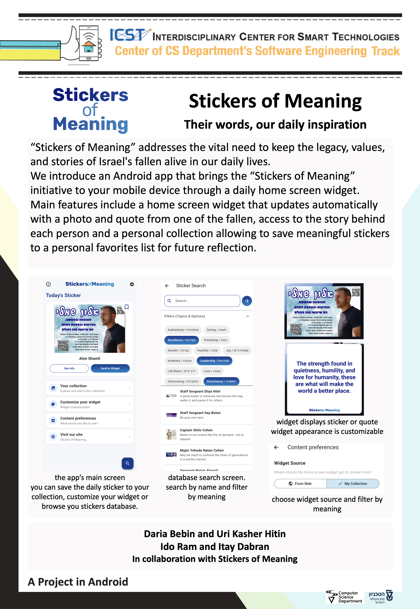

# Stickers of Meaning



## Description

**Stickers of Meaning** is a mobile application dedicated to honoring the legacy of the victims of the Swords of Iron war. The app serves as a digital companion to the "Stickers of Meaning" initiative, bringing the inspiring quotes and personal mottos of the fallen directly to your mobile device.

By displaying a meaningful quote on your home screen every day, the app ensures that the stories, values, and memories of these individuals remain a part of our daily lives. Users can explore the stories behind the quotes, save their favorites, and customize how they wish to remember.

## Main Features

* **Daily Sticker Widget**: A home screen widget that updates daily with a new sticker, featuring a photo and a quote from one of the fallen.
* **Explore Stories**: Tap on any sticker to view the full details, including the person's name (in Hebrew and English), their quote, and a direct link to read their full story on the official website.
* **Personal Collection**: Save stickers that resonate with you to your personal "Collection" to revisit them at any time.
* **Customizable Widget**: Personalize the look of your home screen widget directly from the app settings (adjust transparency, background, etc.).
* **Search & Discover**: Browse or search through the pool of stickers to find specific people or messages.
* **Multi-Language Support**: The app supports both Hebrew and English content.

## About

### About Stickers of Meaning
The **Stickers of Meaning** (מדבקות עם משמעות) initiative was created to memorialize the soldiers and civilians who fell during the Swords of Iron war and the events of October 7th. Families chose personal mottos, quotes, or phrases that guided their loved ones' lives to be printed on stickers alongside their photos. These stickers serve as a testament to their spirit and a way to carry their values forward.

Visit the official website: [stickersofmeaning.org](https://stickersofmeaning.org/)

### About The Developers
This application was built by **Computer Science undergraduates at the Technion – Israel Institute of Technology**.

We developed this app as a part of project in android (2360271) to support the initiative and provide a technological platform that makes these powerful messages accessible to everyone, everywhere, every day. Our goal is to ensure that behind every sticker, the person and their meaning are remembered.

---

### Installation & Setup

This project is a Flutter application.

1.  **Clone the repository**:
    ```bash
    git clone [https://github.com/bbdaria/stickers-of-meaning.git](https://github.com/bbdaria/stickers-of-meaning.git)
    ```
2.  **Open the project**: Open the cloned folder in **Android Studio**.
3.  **Connect a device**: Connect a physical Android device via USB or launch an Android Emulator (Virtual Device).
4.  **Install dependencies**:
    Run the following command in the terminal:
    ```bash
    flutter pub get
    ```
5.  **Run the application**:
    Run `main.dart` on your selected device.

